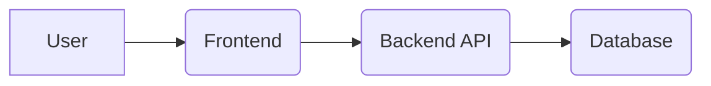
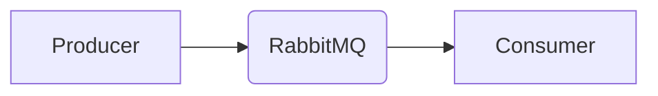
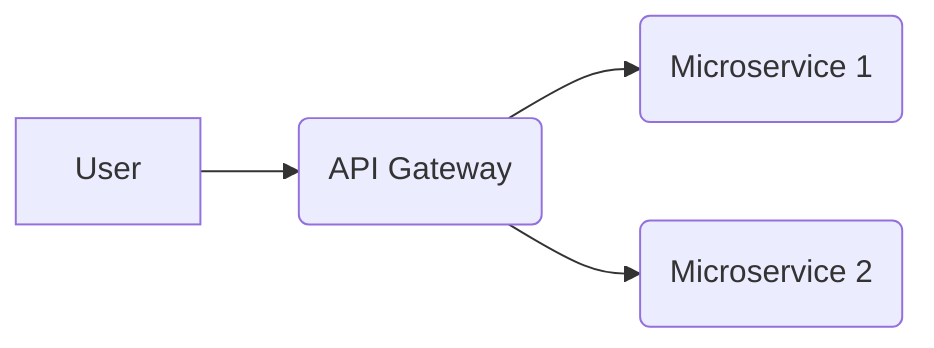

# Example Application Architectures with Docker Compose

This document provides examples of common application architectures and their corresponding Docker Compose configurations. Use these examples as a starting point for building your own multi-container applications. Remember to replace the placeholders with your specific application details.

## Table of Contents

1.  [Simple Web Application (Frontend + Backend + Database)](#simple-web-application)
2.  [Message Queue Application (Producer + Message Broker + Consumer)](#message-queue-application)
3.  [Microservices Architecture (API Gateway + Multiple Microservices)](#microservices-architecture)

## 1. Simple Web Application (Frontend + Backend + Database)

This example demonstrates a basic web application consisting of a frontend, a backend API, and a database.

**Architecture Diagram:**



**Docker Compose Configuration (docker-compose.yml):**

```yaml
version: "3.8"
services:
  frontend:
    image: <YOUR_FRONTEND_IMAGE> # e.g., your-dockerhub-username/frontend:latest
    ports:
      - "80:80" # Map port 80 on the host to port 80 in the container
    depends_on:
      - backend
    restart: always
    networks:
      - app-network

  backend:
    image: <YOUR_BACKEND_IMAGE> # e.g., your-dockerhub-username/backend:latest
    environment:
      DATABASE_URL: postgres://<DB_USER>:<DB_PASSWORD>@db:5432/<DB_NAME>
    depends_on:
      - db
    restart: always
    networks:
      - app-network

  db:
    image: postgres:14 # Or your preferred database image
    environment:
      POSTGRES_USER: <DB_USER>
      POSTGRES_PASSWORD: <DB_PASSWORD>
      POSTGRES_DB: <DB_NAME>
    volumes:
      - db_data:/var/lib/postgresql/data
    restart: always
    networks:
      - app-network
    healthcheck:
      test: ["CMD-SHELL", "pg_isready -U <DB_USER> -d <DB_NAME>"]
      interval: 10s
      timeout: 5s
      retries: 3

volumes:
  db_data:

networks:
  app-network:
    driver: bridge
```

**Instructions:**

1.  Replace `<YOUR_FRONTEND_IMAGE>`, `<YOUR_BACKEND_IMAGE>`, `<DB_USER>`, `<DB_PASSWORD>`, and `<DB_NAME>` with your actual values.
2.  Ensure your frontend and backend applications are properly configured to connect to the database using the environment variable `DATABASE_URL`.
3.  The `depends_on` directive ensures that services start in the correct order.
4.  The `healthcheck` ensures the database is ready before the backend attempts to connect.  Adjust the parameters (interval, timeout, retries) as needed.
5.  The `restart: always` directive ensures that services are automatically restarted if they fail.
6.  Consider using environment variables for sensitive information like passwords.  For production, use Docker secrets.

## 2. Message Queue Application (Producer + Message Broker + Consumer)

This example demonstrates a message queue application using RabbitMQ as the message broker.

**Architecture Diagram:**



**Docker Compose Configuration (docker-compose.yml):**

```yaml
version: "3.8"
services:
  rabbitmq:
    image: rabbitmq:3.9-management # Or your preferred RabbitMQ image
    ports:
      - "5672:5672" # AMQP Port
      - "15672:15672" # Management UI Port
    environment:
      RABBITMQ_DEFAULT_USER: <RABBITMQ_USER>
      RABBITMQ_DEFAULT_PASS: <RABBITMQ_PASSWORD>
    restart: always
    networks:
      - app-network

  producer:
    image: <YOUR_PRODUCER_IMAGE> # e.g., your-dockerhub-username/producer:latest
    depends_on:
      - rabbitmq
    environment:
      RABBITMQ_HOST: rabbitmq
      RABBITMQ_USER: <RABBITMQ_USER>
      RABBITMQ_PASSWORD: <RABBITMQ_PASSWORD>
    restart: always
    networks:
      - app-network

  consumer:
    image: <YOUR_CONSUMER_IMAGE> # e.g., your-dockerhub-username/consumer:latest
    depends_on:
      - rabbitmq
    environment:
      RABBITMQ_HOST: rabbitmq
      RABBITMQ_USER: <RABBITMQ_USER>
      RABBITMQ_PASSWORD: <RABBITMQ_PASSWORD>
    restart: always
    networks:
      - app-network

networks:
  app-network:
    driver: bridge
```

**Instructions:**

1.  Replace `<YOUR_PRODUCER_IMAGE>`, `<YOUR_CONSUMER_IMAGE>`, `<RABBITMQ_USER>`, and `<RABBITMQ_PASSWORD>` with your actual values.
2.  Configure your producer and consumer applications to connect to RabbitMQ using the specified environment variables.
3.  The RabbitMQ management UI is accessible at `http://localhost:15672` (or the appropriate host and port).
4.  Consider using persistent volumes for RabbitMQ data to avoid data loss on container restarts.

## 3. Microservices Architecture (API Gateway + Multiple Microservices)

This example demonstrates a simplified microservices architecture with an API gateway and two microservices.

**Architecture Diagram:**



**Docker Compose Configuration (docker-compose.yml):**

```yaml
version: "3.8"
services:
  api-gateway:
    image: <YOUR_API_GATEWAY_IMAGE> # e.g., your-dockerhub-username/api-gateway:latest
    ports:
      - "8080:8080" # Map port 8080 on the host to port 8080 in the container
    depends_on:
      - microservice1
      - microservice2
    restart: always
    networks:
      - app-network

  microservice1:
    image: <YOUR_MICROSERVICE1_IMAGE> # e.g., your-dockerhub-username/microservice1:latest
    restart: always
    networks:
      - app-network
    environment:
      PORT: 3001

  microservice2:
    image: <YOUR_MICROSERVICE2_IMAGE> # e.g., your-dockerhub-username/microservice2:latest
    restart: always
    networks:
      - app-network
    environment:
      PORT: 3002

networks:
  app-network:
    driver: bridge
```

**Instructions:**

1.  Replace `<YOUR_API_GATEWAY_IMAGE>`, `<YOUR_MICROSERVICE1_IMAGE>`, and `<YOUR_MICROSERVICE2_IMAGE>` with your actual values.
2.  Configure your API gateway to route requests to the appropriate microservices.  The example provides a PORT environment variable that the microservices can use.
3.  Consider using a service discovery mechanism (e.g., Consul, etcd) for more dynamic microservice discovery.
4.  Implement proper authentication and authorization in the API gateway.
5.  Implement monitoring and logging for all services.
6. Consider using health checks for each microservice and exposing them via an endpoint like `/health`. The API Gateway can then use these endpoints to determine if a microservice is healthy before routing traffic.

This is a basic example.  For a production environment, you would likely include additional services for monitoring, logging, and service discovery.  You would also likely use a more sophisticated API gateway solution.