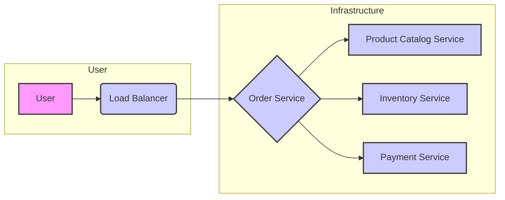

# Example Microservices Architecture

This document outlines an example microservices architecture that can be used with the Service Mesh Configurator plugin. It's designed to be a starting point for configuring Istio or Linkerd for your own microservices applications.

## Overview

This example architecture consists of four microservices:

*   **Product Catalog Service:** Manages product information (name, description, price, etc.).
*   **Inventory Service:** Tracks the available inventory for each product.
*   **Order Service:** Handles order placement and management.
*   **Payment Service:** Processes payments for orders.

These services communicate with each other to fulfill user requests. For example, when a user places an order, the Order Service interacts with the Product Catalog, Inventory, and Payment Services.

## Architecture Diagram



## Service Details

### Product Catalog Service

*   **Purpose:**  Provides information about available products.
*   **Technology Stack:** [Placeholder: Specify technology stack, e.g., Java/Spring Boot]
*   **API Endpoints:**
    *   `/products`:  Returns a list of all products.
    *   `/products/{product_id}`: Returns details for a specific product.
*   **Example Request (GET /products/123):**
    ```json
    {
      "product_id": "123",
      "name": "Example Product",
      "description": "A sample product description.",
      "price": 29.99
    }
    ```
*   **Deployment Details:** [Placeholder: Specify deployment details, e.g., Kubernetes Deployment name, number of replicas]

### Inventory Service

*   **Purpose:** Tracks the inventory levels for each product.
*   **Technology Stack:** [Placeholder: Specify technology stack, e.g., Python/Flask]
*   **API Endpoints:**
    *   `/inventory/{product_id}`: Returns the current inventory level for a product.
    *   `/inventory/{product_id}/update`: Updates the inventory level for a product (requires authentication).
*   **Example Request (GET /inventory/123):**
    ```json
    {
      "product_id": "123",
      "quantity": 50
    }
    ```
*   **Deployment Details:** [Placeholder: Specify deployment details, e.g., Kubernetes Deployment name, number of replicas]

### Order Service

*   **Purpose:** Handles order placement, tracking, and management.
*   **Technology Stack:** [Placeholder: Specify technology stack, e.g., Node.js/Express]
*   **API Endpoints:**
    *   `/orders`: Creates a new order.
    *   `/orders/{order_id}`: Retrieves details for a specific order.
    *   `/orders/{order_id}/status`: Updates the status of an order (requires authentication).
*   **Example Request (POST /orders):**
    ```json
    {
      "user_id": "user123",
      "items": [
        {
          "product_id": "123",
          "quantity": 2
        },
        {
          "product_id": "456",
          "quantity": 1
        }
      ]
    }
    ```
*   **Deployment Details:** [Placeholder: Specify deployment details, e.g., Kubernetes Deployment name, number of replicas]

### Payment Service

*   **Purpose:** Processes payments for orders.
*   **Technology Stack:** [Placeholder: Specify technology stack, e.g., Go]
*   **API Endpoints:**
    *   `/payment`: Processes a payment for an order.
    *   `/payment/{payment_id}`: Retrieves details for a specific payment.
*   **Example Request (POST /payment):**
    ```json
    {
      "order_id": "order123",
      "amount": 89.97,
      "payment_method": "credit_card",
      "credit_card_number": "[Placeholder: Encrypted/Tokenized Credit Card Number]"
    }
    ```
*   **Deployment Details:** [Placeholder: Specify deployment details, e.g., Kubernetes Deployment name, number of replicas]

## Service Mesh Configuration Considerations

This example architecture highlights several areas where a service mesh like Istio or Linkerd can provide significant benefits:

*   **Traffic Management:**  Control the flow of traffic between services (e.g., routing rules, canary deployments, A/B testing).
*   **Security:**  Implement mutual TLS (mTLS) for secure communication between services.
*   **Observability:**  Gain insights into service performance through metrics, tracing, and logging.
*   **Resilience:**  Implement retry policies, circuit breakers, and timeouts to improve application resilience.

## Using the Service Mesh Configurator Plugin

The Service Mesh Configurator plugin can help you automate the configuration of your service mesh based on this architecture.  Specifically, the plugin can assist with:

1.  **Defining Service Mesh Policies:** Creating policies for traffic routing, security, and observability.
2.  **Generating Configuration Files:**  Generating the necessary YAML files for deploying Istio or Linkerd configurations.
3.  **Validating Configurations:** Ensuring that your configurations are valid and conform to best practices.

To use the plugin, provide the relevant details about your microservices (technology stack, API endpoints, deployment details) in the placeholders above. The plugin will then use this information to generate the appropriate service mesh configuration.

Remember to replace the placeholder values with your actual service details.