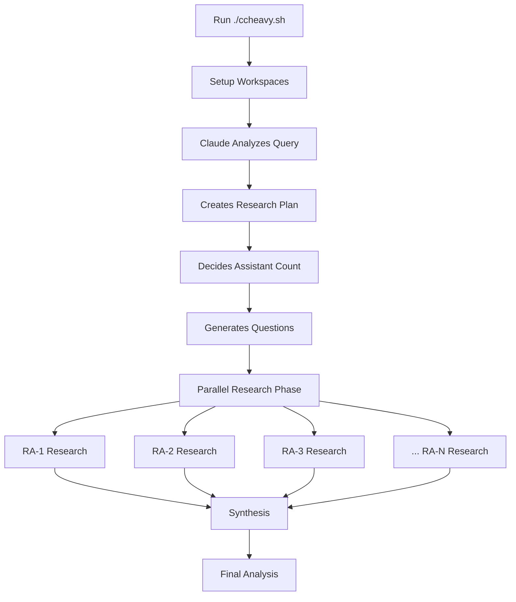

# Claude Code Heavy

A powerful multi-agent research system using Claude Code to deliver comprehensive, multi-perspective analysis through intelligent orchestration. Inspired by Grok's heavy mode and make-it-heavy.

## 🚀 What is Claude Code Heavy?

Claude Code Heavy gives Claude full control to orchestrate parallel research:
- 🧠 **Intelligent Planning**: Claude analyzes your query and creates the optimal research strategy
- 🔀 **Parallel Research**: Claude decides how many agents to deploy (2-8 available)
- 🎯 **Dynamic Adaptation**: Questions and roles are tailored to your specific query
- 🔄 **Smart Synthesis**: Claude combines all findings into unified insights
- 🚙 **Interactive Mode**: Simple setup with powerful results

## 🎯 Quick Start

```bash
# Clone the repo
git clone https://github.com/yourusername/claude-code-heavy
cd claude-code-heavy

# Make script executable
chmod +x ccheavy.sh

# Run interactively (recommended)
./ccheavy.sh

# Or run with command line args
./ccheavy.sh "How do we solve the global water supply issue?"
```

## 🤔 Why This Approach?

**Claude is the Intelligence**: Instead of hard-coding research patterns, we let Claude:
- Analyze your query and determine the best approach
- Decide how many research assistants are needed
- Create specific, targeted research questions
- Adapt the research strategy in real-time

**Pre-built Infrastructure**: The script simply:
- Creates 8 research workspaces (worktrees)
- Sets up output directories
- Launches Claude with full orchestration control

## 📖 How It Works



### Process Flow

1. **You provide a query**: Any research question or topic
2. **Script prepares environment**: Creates 8 workspaces, output directories
3. **Claude takes over**:
   - Analyzes complexity and scope
   - Plans optimal research strategy
   - Creates targeted questions
   - Orchestrates parallel execution
   - Synthesizes comprehensive results

## 🛠️ Installation

### Prerequisites
- Claude Code installed (`npm install -g @anthropic-ai/claude-code`)
- Claude Pro or Teams subscription (strongly recommended for best performance)
- Git with worktree support (git 2.7+)
- Unix-like environment (Mac/Linux/WSL)

### Setup
```bash
# Clone and setup
git clone https://github.com/gtrusler/claude-code-heavy
cd claude-code-heavy
./setup.sh
```

## 🎮 Usage

### Interactive Mode (Recommended)
```bash
./ccheavy.sh
# Follow the prompts:
# - Enter your research question
# - Choose output format (markdown/text)
# - Decide on dangerous mode (default: N)
# - Confirm to proceed (default: Y)
# - Optionally auto-launch Claude Code (default: Y)
```

### Command Line Mode
```bash
# Basic usage
./ccheavy.sh "What are the latest advances in quantum computing?"

# With text output
./ccheavy.sh "Explain Docker containers" text

# YOLO mode
./ccheavy.sh "Analyze my codebase" markdown --dangerous
```

### Output Structure
```
outputs/
└── 2025-07-18-solve-global-water-crisis/
    ├── orchestration-prompt.md    # Initial prompt for Claude
    ├── research-plan.md          # Claude's research strategy
    ├── assistants/
    │   ├── ra-1-findings.md      # Assistant 1's research
    │   ├── ra-2-findings.md      # Assistant 2's research
    │   └── ...                   # Up to 8 assistants
    └── final-analysis.md         # Synthesized results
```

## 📋 Example Outputs

See the `examples/` directory for complete research outputs:

### 1. Austin's 5-Year Outlook
- **Query**: "What does the outlook for the next 5 years look like for Austin, TX?"
- **Assistants**: 6 (Claude's decision based on complexity)
- **Total Output**: ~11,500 words
- **Key Insights**: Economic growth, tech hub evolution, infrastructure challenges

### 2. AI's Impact on Healthcare  
- **Query**: "How will AI impact healthcare?"
- **Assistants**: 5 (covering different healthcare domains)
- **Focus Areas**: Diagnostics, drug discovery, patient care, ethics, implementation
- **Comprehensive analysis** of transformation across the industry

Quick examples of queries Claude handles well:

- **Scientific**: "How do mRNA vaccines work?"
- **Business**: "Analyze the electric vehicle market"
- **Policy**: "Evaluate universal basic income proposals"
- **Technical**: "Compare Rust vs Go for systems programming"
- **Historical**: "What led to the fall of the Roman Empire?"
- **Local**: "What's the 5-year outlook for Austin, TX?"

## 🔧 Configuration

The script is intentionally minimal. Claude handles:
- Determining optimal assistant count
- Creating research questions
- Assigning roles and perspectives
- Adapting to query complexity

## 🚀 Advanced Features

### Security Options
- Option to use `--dangerously-skip-permissions` flag
- Default is secure mode (recommended)
- Only enable for trusted research tasks

### Parallel Execution
- Claude orchestrates parallel tool calls
- Multiple web searches execute simultaneously
- Faster research completion

### Smart Folder Naming
- Queries converted to readable folder names automatically
- Date prefixing for easy chronological sorting
- Example: "How will AI impact health care?" → `2025-07-18-how-will-ai-impact-health-care`

## 🏗️ Architecture

### Why Git Worktrees?
- Each assistant gets isolated workspace
- Parallel execution without conflicts
- Easy context switching for Claude
- Git tracks all research history

### Why Let Claude Decide?
- Every query is unique
- Claude understands context better
- Dynamic adaptation beats static patterns
- Optimal resource allocation

## 🐛 Troubleshooting

### "Command not found: claude"
Make sure Claude Code is installed: `npm install -g @anthropic-ai/claude-code`

### "Git worktree error"
```bash
# Update git
brew upgrade git  # Mac
sudo apt-get update && sudo apt-get upgrade git  # Linux
```

### Research seems slow
- Normal research takes 5-10 minutes
- Complex queries may take up to 15-20 minutes
- Check if web searches are working

## 🤝 Contributing

1. Fork the repository
2. Create your feature branch
3. Test with various query types
4. Submit a pull request

## 📄 License

MIT License with Commercial Attribution Requirement

**For products with 100K+ users**: Please include attribution to Graydon Trusler and mention the "Claude Code Heavy" framework in your documentation or credits.

See [LICENSE](LICENSE) file for full details.

## 🙏 Acknowledgments

- Inspired by [make-it-heavy](https://github.com/Doriandarko/make-it-heavy) by Pietro Schirano
- Inspired by Grok Heavy mode
- Built on Claude Code by Anthropic
